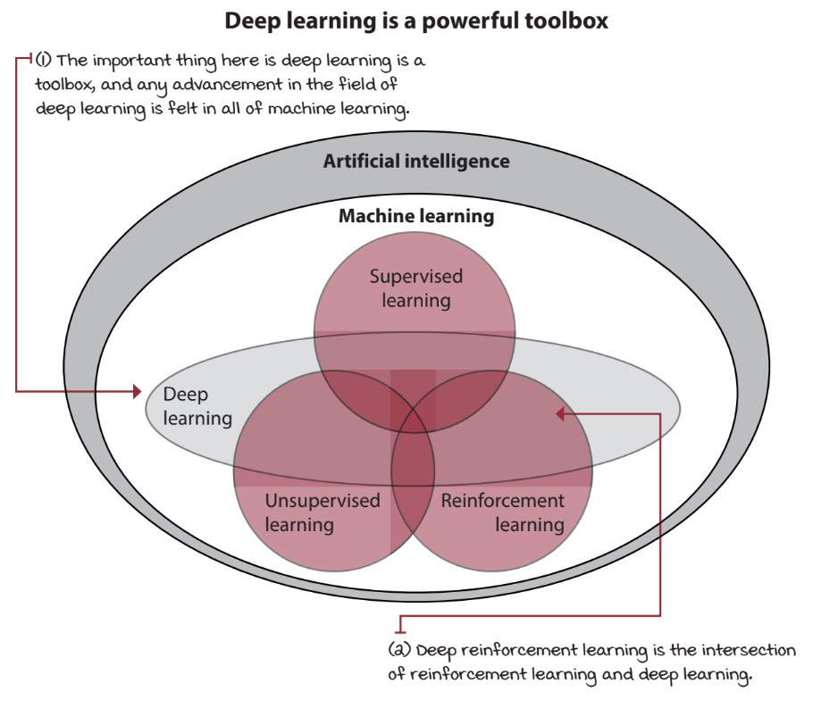
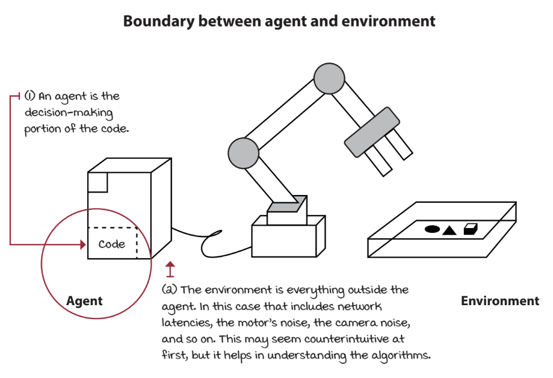
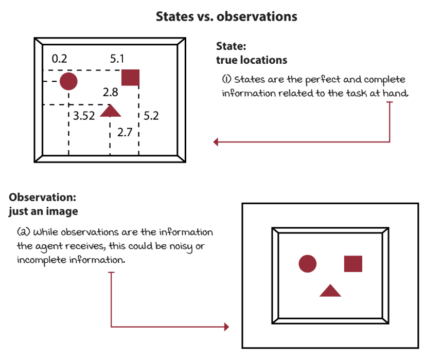
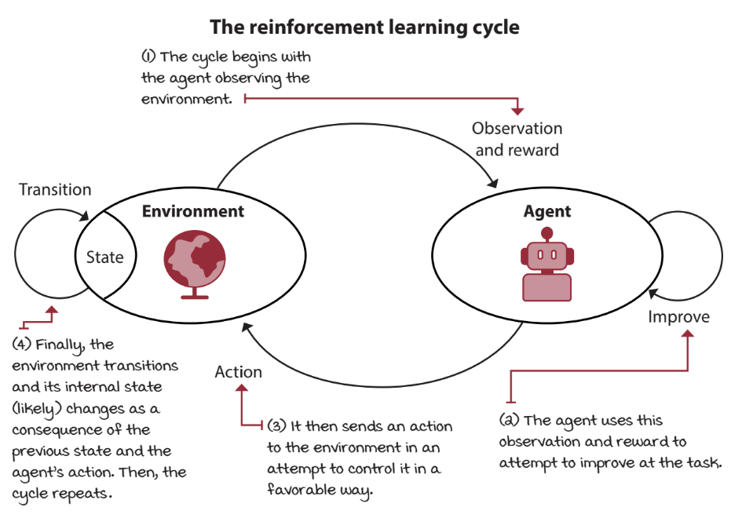
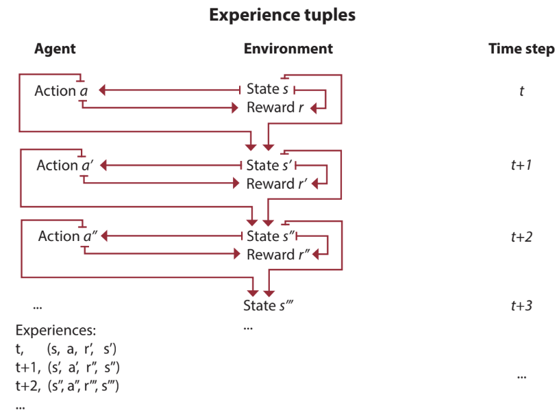

## Chapter 1 - Introduction to Reinforcement Learning

### Overview

Machine learning (ML) can be divided into three mainstream categories: Supervised Learning (SL), Unsupervised Learning (UL), and Reinforcement Learning (RL). SL is the task of learning from labeled data to produce a generalized mapping that can take unseen data as input. An example of SL is MNIST digit classification. UL is the task of compressing data by recognizing patterns. An example of UL is K-Means clustering. RL is the task of learning through trial and error by acting, observing and improving. An example of RL is a humanoid robot learning to walk.

  
  <figcaption align="center">The relationship between SL, UL, RL, and DL (Morales, 2020).</figcaption>

Another subcategory of ML is Deep Learning (DL), which involves using multi-layered non-linear function approximation, such as artificial neural networks. The intersection of DL with RL is called Deep Reinforcement Learning (DRL) and involves using function approximations to simplify the problem for computational feasibility.

### Agent vs. Environment

At its core, RL is about complex sequential decision-making problems under uncertainty. The computer program that makes these decisions is referred to as an *agent*. This term excludes the body which the agent is controlling, for example a robot arm. *Agent* refers strictly to the computer program itself.

  
  <figcaption align="center">An agent and the environment (Morales, 2020).</figcaption>

On the other side of the agent is an *environment*, which includes the space the agent is interacting with, and everything within it, including, say the aforementioned robot arm, and any object or force the robot arm can interact with.

### State vs. Observation

The environment of a RL problem is composed of variables that describe the environment. The set of these variables and all their possible combinations is referred to as the *state space*. All points in a state space have a combination of numbers that describes a unique *state*. In the robot arm example, the state space encompasses all joint poisitions and velocities, among other variables. A state in the robot arm state space would then include exact values for each of these variables.

  
  <figcaption align="center">A state and an observation (Morales, 2020).</figcaption>

In many RL problems, the agent does not have access to the full state of the environment. For example, a humanoid robot can observe the world only through data from its sensors, such as encoders and cameras to name a few, but it does not have access to its true position in 3D space, even though that is part of the full state. The part of a state the agent can observe is called an *observation* and the combination of all possible observations is the *observation space*.

### The Learning Cycle

At each state, the agent chooses an available *action* that influences the environment, which may result in the state being changed. The set of all actions in all states is referred to as the *action space*. The function that maps transition from one state to another is called the *transition function*. After each transition, a reward may be provided by a *reward function*, which is designed to provide a measure of how well the transition followed the objective. The reward function is what defines this objective and can be simultaneously sequential, evaluative, and sampled.

**Sequential:** Changes over time. 
**Evaluative:** Provides only a measure of goodness, rather than 'what it should have done' (which would be *instructive* instead). 
**Sampled:** The reward is discovered by the agent interacting with the environment and sampling an experience.

  
  <figcaption align="center">The reinforcement learning cycle (Morales, 2020).</figcaption>

The agent has a three-step process: **interact -> evaluate -> improve**. The agent can be designed to learn mappings from observations to actions called *policies*, the model of the environment on mappings are called *models* and to estimate the reward-to-go on mappings called *value functions*.

**Policy:** The algorithm that chooses an action based on an observation. 
**Model:** An internal representation of the environment, consisting of a transition function and a reward function. 
**Value Function:** Estimates the expected reward for being in a particular state.

### Experience

The agent-environment interaction cycle can go on for several cycles, each called a *time step*. At each time step, the set of the state, the action, the reward, and the new state is called an *experience*. This is analagous to how humans interact with the world to accumulate experience. Tasks that have a natural ending are called *episodic*, and ones that do not are called *continuing*. The sequence of time steps from the beginning of an episodic task until the end is called an *episode*.

  
  <figcaption align="center">The time step cycle (Morales, 2020).</figcaption>

An action you take in the present may have delayed consequences that only appear later in time. The *temporal credit assignment problem* refers to the challenge of determining what state and/or action is responsible for a reward. For example, if you scored an A+ on an exam, is it because you were smiling when handing in the exam, or because you studied for it?

### Exploration vs. Exploitation

*Evaluative feedback* only provides a measure of goodness and it lacks information about other potential rewards. This means the agent must explore the environment in order to discover novel rewards. However, the agent must also use its knowledge to make good decisions, otherwise it will always perform poorly. This gives rise to the *exploration versus exploitation trade-off*.

**Exploration:** The act of choosing an underexplored action just to see the outcome and potentially discover a better outcome, moving out of a local optimum. 
**Exploitation:** The act of choosing the action that is guaranteed to provide a good reward to the best of the agent's knowledge.

## Quiz

**1. Which of the following problems are supervised and which are reinforcement?**

A) Object Detection

B) Aircraft Control

C) Self-Driving Car

**2. Define an environment for each of the following problems.**

A) Stock Trading

B) Path Planning

C) Tic-Tac-Toe

**3. Which of the following tasks are continuing and which are episodic?**

A) Controlling an aircraft

B) Winning a chess game

C) Sorting items in a production line

**4. Which of the following feedbacks are evaluative and which are instructive?**

A) L2 distance between a prediction and the target

B) Reward for reaching a goal

C) Penalty that scales inversely with the speed of an aircraft

**5. Which of the following policies are exploiting and which are exploring?**

A) The chosen action follows a uniform distribution

B) The chosen action has the highest predicted value

C) The chosen action is sampled from a normal distribution with a mean corresponding to the action with the highest predicted value

## Sources

Morales, M. (2020). *Grokking deep reinforcement learning*. Manning Publications.