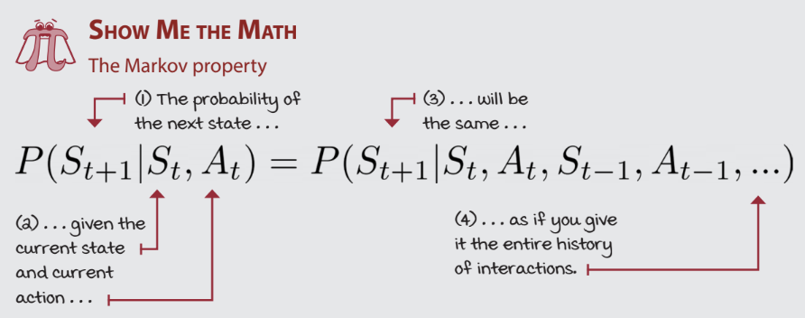
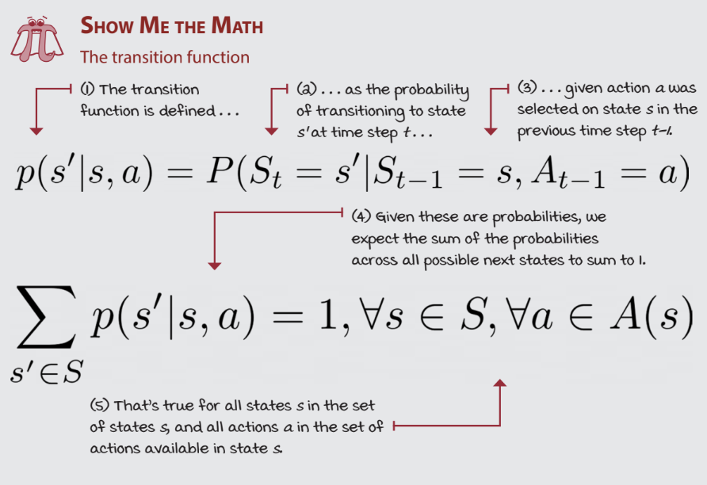
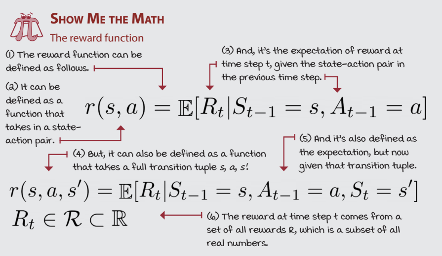
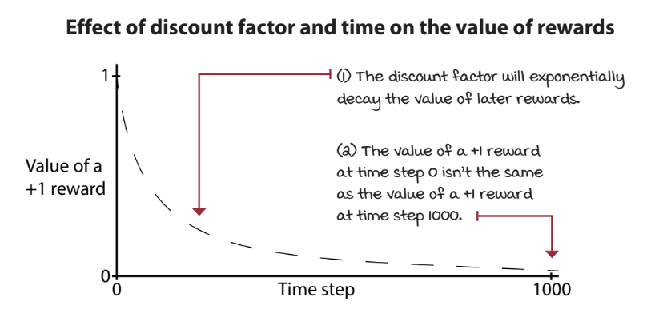
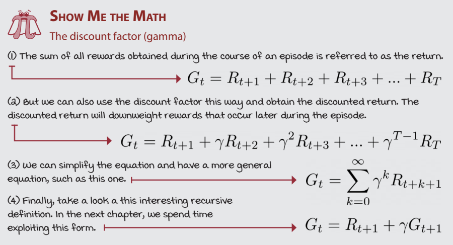

## Chapter 2 - Mathematical Foundations of Reinforcement Learning

### Bandits

A *bandit* is a special case of an MDP in which there is only one non-terminal state. Every MDP has a set of non-terminal states, denoted $S$; a bandit is simply the case where $|S| = 1$, meaning the agent is always in that same single state, no matter what actions it takes. Named after the "one-armed bandit" slot machine, the agent repeatedly chooses among a fixed set of actions (e.g. which slot machine arm to pull), receives a reward, and then finds itself back in the same state to choose again.

Because the non-terminal state never changes, the transition function collapses trivially, and the value of an action does not depend on "where" the agent currently is — only on the reward the action produces. Full MDPs, covered next, generalize this by allowing $|S| > 1$, so that the environment can move between many different states in response to the agent's actions, and the same action can be better or worse depending on the state the agent is currently in.

### Markov Decision Processes (MDPs)

In RL problems, there is usually plenty of *uncertainty*, which refers to the fact that you do not know the inner workings of the environment, or how the agent's actions affect it. Such problems can be represented with Markov Decision Processes (MDPs). Additionally, the environment may be *stochastic*, rather than *deterministic*, meaning the intended action or transition may not always take place, which is befitting of the real world.

Formally, an MDP is defined by the tuple $\langle S^+, A, T, R \rangle$:

- $S^+$: the set of all states, including the terminal state.
- $A$: the set of all actions, with $A(s)$ denoting the actions available in state $s$.
- $T$: the transition function, described below.
- $R$: the reward function, covered in the next section.

In the case of MDPs, the state is fully observable, meaning the observation and the state at a time step are the same. Partially Observable Markov Decision Processes (POMDPs), on the other hand, uphold the fact that the agent does not have access to the full state. MDPs have a property known as the *Markov property*, which refers to the requirement that states must contain all the variables necessary to make them independent of all other states. In other words, you only need the current state and action to know what happens next, and you do not need the history of states that were visited:

$$P(S_{t+1} \mid S_t, A_t) = P(S_{t+1} \mid S_1, A_1, S_2, A_2, \dots, S_t, A_t)$$

This equation states that predicting the next state only requires the current state and action — conditioning on the entire history of states and actions provides no additional information.

  
  <figcaption align="center">The Markov property (Morales, 2020).</figcaption>

The set of all states in the MDP is denoted $S^+$. There is a subset of $S^+$ called the set of starting or initial states, denoted $S^i$. To begin interacting with an MDP, we draw a state from $S^i$ according to a starting-state distribution:

There is a unique state called the absorbing or terminal state, and the set of all non-terminal states is denoted $S$. When the agent reaches a terminal state, the next state is guaranteed to be the same as the terminal state. The set of available actions, $A$, is determined by the current state, $s$, denoted as $A(s)$. The way the environment changes as a response to actions is referred to as the state-transition probabilities, or more simply, the transition function, and is denoted by $T(s, a, s')$. Formally, this is the conditional probability of landing in state $s'$ given that action $a$ was taken in state $s$:

$$T(s,a,s') = p(s' \mid s, a) = P(S_{t+1} = s' \mid S_t = s, A_t = a)$$

Because $p(\cdot \mid s, a)$ is a probability distribution over next states, it must sum to one across every possible next state:

$$\sum_{s' \in S^+} p(s' \mid s, a) = 1, \qquad \forall s \in S,\ a \in A(s)$$

  
  <figcaption align="center">The Markov property (Morales, 2020).</figcaption>

In the fully general case, the transition and reward functions are combined into a single joint distribution over the next state *and* the reward received:

$$p(s', r \mid s, a) = P(S_{t+1}=s',\ R_{t+1}=r \mid S_t=s,\ A_t=a)$$

Note that either one, or both, of the environment and actions can be stochastic. A stochastic environment means even if you take a specific action given a specific state, the next state is not guaranteed to be the same every time. A stochastic action means a particular action you intend to take may not take place, but instead a different action may be performed unintentionally.

### Rewards and Goals

Reinforcement learning is evaluative, so evaluations of the agent's actions are defined by a reward function. The reward function provides a measure of how rewarding an action is, given a specific state. This helps in determining how valuable it is to take a certain action or even just being in a certain state. A *return* is the sum of rewards collected in a single episode.

  
  <figcaption align="center">The reward function (Morales, 2020).</figcaption>

### Episodic vs. Continuing Tasks

Tasks with a natural ending are called *episodic*, while tasks that continue indefinitely are called *continuing*. In the language of MDPs, an episodic task is one that is guaranteed to reach the terminal state (defined above as part of $S^+$) within a finite number of time steps, after which the environment resets and a new episode begins. A continuing task has no terminal state at all, or the agent simply never reaches it.

This distinction matters because it changes how far ahead the agent should plan, referred to as the *planning horizon*.

**Finite Horizon:** The agent knows the task will terminate in a finite, known number of time steps.

**Infinite Horizon:** Whether the underlying task is episodic or continuing, the agent acts as if it could go on forever, without assuming a fixed stopping point.

### Return

In most cases, it is better for the agent to make crucial decisions early on, rather than later. To encourage the agent to act this way, we can introduce a *discount* on the reward that scales the output of the reward function down as the number of elapsed time steps increases.

  
  <figcaption align="center">The effect of discount factor and time on the value of rewards (Morales, 2020).</figcaption>

Discounts on the reward can be applied by using a *discount factor*, $0<\gamma<1$, which is exponentiated by the number of elapsed time steps and multiplied with the reward at the specific time step:

$$G_t = R_{t+1} + \gamma R_{t+2} + \gamma^2 R_{t+3} + \dots = \sum_{k=0}^{\infty} \gamma^k R_{t+k+1}$$

  
  <figcaption align="center">Return and discount (Morales, 2020).</figcaption>

Because $0 < \gamma < 1$, rewards further in the future are worth exponentially less than immediate rewards. For episodic tasks, the sum simply stops at the terminal state's time step rather than continuing to infinity. Return is a crucial concept in training agents, because it can be used to associate states and actions with long-term rewards, rather than short-term rewards.

### Policies

A policy, denoted $\pi$, is a mapping from states to actions (or to probabilities of selecting each action) that fully determines the agent's behavior.

A **deterministic policy** always selects the same action for a given state:

$$\pi(s) = a$$

A **stochastic policy** instead defines a probability distribution over actions for a given state:

$$\pi(a \mid s) = P(A_t = a \mid S_t = s)$$

Stochastic policies are useful because they allow the agent to explore its environment — for example, an equiprobable random policy where every action in a state is equally likely — whereas deterministic policies are useful once the agent is confident in the best action to take in every state.

### Value Functions

Because return depends on future rewards, agents can use *value functions* to estimate expected return without needing to actually finish an episode. Value functions are always defined with respect to a specific policy $\pi$, since the actions the agent will take in the future affect how much reward it can expect to receive.

The **state-value function**, $v_\pi(s)$, gives the expected return of starting in state $s$ and following policy $\pi$ thereafter:

$$v_\pi(s) = \mathbb{E}_\pi[G_t \mid S_t = s]$$

The **action-value function**, $q_\pi(s,a)$, gives the expected return of starting in state $s$, taking action $a$, and following policy $\pi$ thereafter:

$$q_\pi(s,a) = \mathbb{E}_\pi[G_t \mid S_t = s, A_t = a]$$

The distinction matters because $v_\pi(s)$ tells the agent how good a *state* is under its current policy, while $q_\pi(s,a)$ tells the agent how good a specific *action* is in that state — which is what's actually needed to decide what to do next. Tutorial Three shows how these value functions can be computed and improved iteratively using Dynamic Programming.

## Sources

Morales, M. (2020). *Grokking deep reinforcement learning*. Manning Publications.